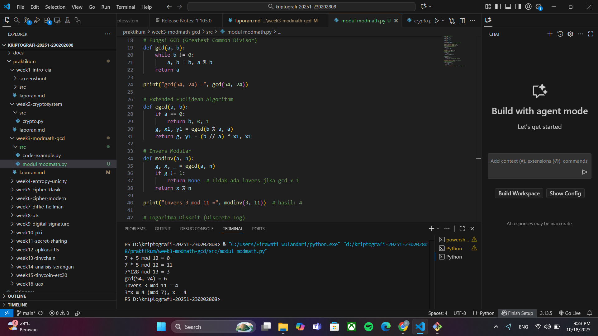

# Laporan Praktikum Kriptografi
Minggu ke-: 3  
Topik: [Modular Math]  
Nama: [Ferdy Ramadhani]  
NIM: [230202808]  
Kelas: [5IKRA]  

---

## 1. Tujuan
1. Menyelesaikan operasi aritmetika modular.
2. Menentukan bilangan prima dan menghitung GCD (Greatest Common Divisor).
3. Menerapkan logaritma diskrit sederhana dalam simulasi kriptografi.

---

## 2. Dasar Teori
Dalam kriptografi, cipher klasik merupakan metode penyandian pesan yang digunakan sejak zaman dahulu sebelum munculnya komputer modern. Cipher ini bekerja dengan cara mengubah huruf atau simbol dalam pesan asli (plaintext) menjadi bentuk baru (ciphertext) berdasarkan aturan tertentu. Contoh paling dikenal adalah Caesar Cipher dan Vigenère Cipher, yang menggunakan pergeseran huruf atau pola kunci tertentu. Tujuan utamanya adalah menjaga kerahasiaan pesan dari pihak yang tidak berwenang.

Konsep penting yang mendasari cipher klasik adalah modular aritmetika, yaitu sistem perhitungan yang menggunakan operasi “modulo”. Dalam konteks ini, angka akan “berulang” setelah mencapai batas tertentu, seperti perhitungan jam. Misalnya, pada Caesar Cipher yang memakai 26 huruf alfabet, pergeseran huruf dilakukan dengan rumus C = (P+K) mod 26,dimana P adalah huruf asli, K adalah kunci pergeseran,dan hasilnya C adalah huruf terenkripsi.

Dengan demikian, cipher klasik memanfaatkan sifat berulang dari modular aritmetika untuk mengubah dan mengembalikan pesan, sehingga pesan tetap bisa dikirim dengan aman meski tanpa teknologi digital.

---

## 3. Alat dan Bahan
(- Python 3.x  
- Visual Studio Code / editor lain  
- Git dan akun GitHub  
- Library tambahan (misalnya pycryptodome, jika diperlukan)  )

---

## 4. Langkah Percobaan
(Tuliskan langkah yang dilakukan sesuai instruksi.  
Contoh format:
1. Membuat file `caesar_cipher.py` di folder `praktikum/week2-cryptosystem/src/`.
2. Menyalin kode program dari panduan praktikum.
3. Menjalankan program dengan perintah `python caesar_cipher.py`.)

---

## 5. Source Code
(Salin kode program utama yang dibuat atau dimodifikasi.  
Gunakan blok kode:

```python
# Operasi Aritmetika Modular
def mod_add(a, b, n):
    return (a + b) % n

def mod_sub(a, b, n):
    return (a - b) % n

def mod_mul(a, b, n):
    return (a * b) % n

def mod_exp(base, exp, n):
    return pow(base, exp, n)  # Eksponensiasi modular

print("7 + 5 mod 12 =", mod_add(7, 5, 12))
print("7 * 5 mod 12 =", mod_mul(7, 5, 12))
print("7^128 mod 13 =", mod_exp(7, 128, 13))

# Fungsi GCD (Greatest Common Divisor)
def gcd(a, b):
    while b != 0:
        a, b = b, a % b
    return a

print("gcd(54, 24) =", gcd(54, 24))

# Extended Euclidean Algorithm
def egcd(a, b):
    if a == 0:
        return b, 0, 1
    g, x1, y1 = egcd(b % a, a)
    return g, y1 - (b // a) * x1, x1

# Invers Modular
def modinv(a, n):
    g, x, _ = egcd(a, n)
    if g != 1:
        return None  # Tidak ada invers jika gcd ≠ 1
    return x % n

print("Invers 3 mod 11 =", modinv(3, 11))  # hasil: 4

# Logaritma Diskrit (Discrete Log)
def discrete_log(a, b, n):
    for x in range(n):
        if pow(a, x, n) == b:
            return x
    return None

print("3^x ≡ 4 (mod 7), x =", discrete_log(3, 4, 7))  # hasil: 4

```
)

---

## 6. Hasil dan Pembahasan


Hasil percobaan menunjukkan bahwa seluruh operasi aritmetika modular berjalan sesuai teori, di mana diperoleh hasil:  

$$(7 + 5) \bmod 12 = 0$$  
$$(7 \times 5) \bmod 12 = 11$$  
$$7^{128} \bmod 13 = 3$$  

Nilai **GCD** dari 54 dan 24 adalah:  
$$\gcd(54, 24) = 6$$  

Sedangkan **invers dari 3 modulo 11** adalah:  
$$3 \times 4 \equiv 1 \pmod{11} \Rightarrow \text{invers}(3, 11) = 4$$  

Pada percobaan **logaritma diskrit** diperoleh:  
$$3^x \equiv 4 \pmod{7} \Rightarrow x = 4$$  

Semua hasil sesuai dengan perhitungan teoretis dan tidak ditemukan error selama eksekusi program. Dengan demikian, implementasi program berhasil menggambarkan konsep dasar aritmetika modular yang menjadi fondasi utama dalam kriptografi modern seperti **RSA** dan **Diffie-Hellman**.


Hasil eksekusi program modular math:

)


---

## 7. Jawaban Pertanyaan
1. Apa peran aritmetika modular dalam kriptografi modern?
 
 Dalam kriptografi modern, aritmetika modular memiliki peran yang sangat penting sebagai dasar dari berbagai algoritma enkripsi dan dekripsi. Aritmetika modular digunakan untuk mengolah bilangan besar dengan cara yang aman dan efisien, terutama karena sifatnya yang berulang dan sulit dibalik tanpa mengetahui kunci tertentu.

 Konsep ini banyak diterapkan dalam algoritma kunci publik, seperti RSA, Diffie-Hellman, dan Elliptic Curve Cryptography (ECC). Misalnya, pada algoritma RSA, operasi enkripsi dan dekripsi dilakukan menggunakan pangkat dan modulo bilangan prima besar, sehingga hasilnya sulit dihitung secara terbalik tanpa kunci privat. Inilah yang menjadikan sistem tersebut aman terhadap serangan brute-force.

 Selain itu, aritmetika modular juga membantu menjaga integritas dan keamanan data, karena memungkinkan pembentukan fungsi matematika yang bersifat satu arah—mudah dihitung ke depan, tetapi sangat sulit untuk dibalik tanpa informasi rahasia.

 Dengan demikian, aritmetika modular bukan hanya konsep matematika dasar, tetapi merupakan pondasi utama dalam keamanan kriptografi modern, yang memastikan data digital dapat dikirim dan disimpan secara aman di era teknologi saat ini.
 
 2. Mengapa invers modular penting dalam algoritma kunci publik (misalnya RSA)?

 Invers modular sangat penting dalam algoritma kunci publik seperti RSA karena berfungsi untuk membalik proses enkripsi menjadi dekripsi. Dalam RSA, pesan yang telah dienkripsi hanya bisa dikembalikan ke bentuk aslinya dengan menggunakan invers dari kunci publik terhadap modulus tertentu. Tanpa invers modular, proses pembalikan ini tidak mungkin dilakukan secara matematis.

 Dengan kata lain, invers modular memastikan bahwa hanya pemilik kunci privat yang dapat memulihkan pesan asli, sehingga menjaga kerahasiaan dan keamanan komunikasi. Inilah alasan mengapa konsep invers modular menjadi komponen utama dalam mekanisme kerja kriptografi modern.
 
 3. Apa tantangan utama dalam menyelesaikan logaritma diskrit untuk modulus besar?

 Tantangan utama dalam menyelesaikan logaritma diskrit untuk modulus besar terletak pada tingkat kesulitannya yang sangat tinggi secara komputasional. Logaritma diskrit melibatkan mencari nilai eksponen dalam persamaan g^x = h (mod p).Ketika modulus p berukuran sangat besar,kombinasi kemungkinan nilai x menjadi luar biasa banyak, sehingga hampir mustahil dihitung secara efisien dengan cara biasa.

Algoritma brute-force membutuhkan waktu yang sangat lama, bahkan dengan komputer modern, karena tidak ada metode cepat yang diketahui untuk menghitung logaritma diskrit pada bilangan prima besar. Inilah alasan mengapa banyak sistem keamanan seperti Diffie-Hellman dan ElGamal bergantung pada kesulitan masalah ini sebagai dasar keamanan mereka.

Dengan demikian, kesulitan menyelesaikan logaritma diskrit pada modulus besar menjadi pondasi penting dalam kekuatan kriptografi modern, karena menjamin bahwa pesan tetap aman dari upaya pembobolan matematis.
)

---

## 8. Kesimpulan
(Tuliskan kesimpulan singkat (2–3 kalimat) berdasarkan percobaan.  )

---

## 9. Daftar Pustaka
(Cantumkan referensi yang digunakan.  
Contoh:  
- Katz, J., & Lindell, Y. *Introduction to Modern Cryptography*.  
- Stallings, W. *Cryptography and Network Security*.  )

---

## 10. Commit Log
(Tuliskan bukti commit Git yang relevan.  
Contoh:
```
commit 56922b24d0a4f295cad65354c33084daeae667c1
Author: Ferdyramadhani <ferdyramadhani225@gmail.com>
Date:   Sat Oct 18 21:35:19 2025 +0700

    week3-modmath-gcd

```
