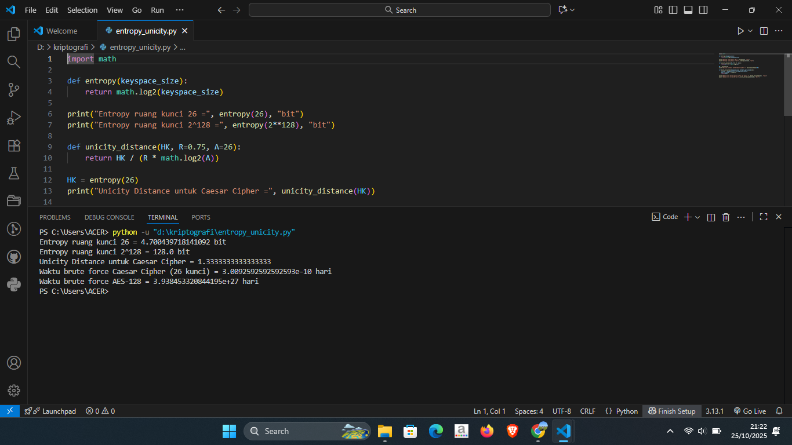

# Laporan Praktikum Kriptografi
Minggu ke-: 4  
Topik: [Entropy & Unicity Distance]  
Nama: [Ferdy Ramadhani]  
NIM: [230202808]  
Kelas: [5IKRA]  

---

## 1. Tujuan
1. Menyelesaikan perhitungan sederhana terkait entropi kunci.
2. Menggunakan teorema Euler pada contoh perhitungan modular & invers.
3. Menghitung unicity distance untuk ciphertext tertentu.
4. Menganalisis kekuatan kunci berdasarkan entropi dan unicity distance.
5. Mengevaluasi potensi serangan brute force pada kriptosistem sederhana.

---

## 2. Dasar Teori
Entropi merupakan salah satu konsep penting dalam teori informasi yang dikembangkan oleh Claude E. Shannon. Dalam konteks kriptografi, entropi menggambarkan tingkat ketidakpastian atau kerandoman suatu sistem, khususnya pada bagian kunci enkripsi. Semakin tinggi nilai entropi suatu kunci, semakin sulit bagi pihak lain untuk menebak atau memecahkannya. Dengan kata lain, entropi berfungsi sebagai ukuran seberapa aman sebuah sistem kriptografi berdasarkan tingkat acaknya kunci yang digunakan.

Entropi juga dapat dipahami sebagai jumlah informasi yang dibutuhkan untuk menggambarkan suatu keadaan atau pesan. Jika suatu sistem memiliki banyak kemungkinan kombinasi kunci atau pola yang tidak terprediksi, maka entropinya tinggi dan sistem tersebut dianggap memiliki keamanan yang lebih baik. Sebaliknya, jika kunci yang digunakan mudah ditebak atau mengikuti pola tertentu, maka entropinya rendah, sehingga sistem menjadi lebih rentan terhadap serangan.

Sementara itu, unicity distance atau jarak keunikan adalah konsep yang menjelaskan jumlah minimum data terenkripsi yang dibutuhkan agar kunci enkripsi dapat diidentifikasi secara pasti. Konsep ini juga diperkenalkan oleh Shannon untuk menilai sejauh mana suatu sistem kriptografi dapat bertahan dari analisis serangan. Jika suatu sistem memiliki unicity distance yang tinggi, artinya dibutuhkan banyak data terenkripsi untuk menemukan kunci yang benar, sehingga sistem tersebut lebih aman. Sebaliknya, jika nilai unicity distance rendah, maka hanya dengan sedikit data, penyerang mungkin sudah bisa menebak kunci yang digunakan.

Secara sederhana, entropi berhubungan dengan tingkat kerandoman dan kekuatan kunci, sedangkan unicity distance berkaitan dengan jumlah data yang diperlukan untuk memecahkan kunci tersebut. Kedua konsep ini saling berkaitan dalam menentukan seberapa kuat dan aman suatu sistem kriptografi. Dengan memahami entropi dan unicity distance, perancang sistem keamanan dapat memastikan algoritma enkripsi yang digunakan memiliki tingkat perlindungan yang tinggi terhadap berbagai bentuk serangan.

---

## 3. Alat dan Bahan
(- Python 3.x  
- Visual Studio Code / editor lain  
- Git dan akun GitHub  
- Library tambahan (misalnya pycryptodome, jika diperlukan)  )

---

## 4. Langkah Percobaan
(Tuliskan langkah yang dilakukan sesuai instruksi.  
Contoh format:
1. Membuat file `caesar_cipher.py` di folder `praktikum/week2-cryptosystem/src/`.
2. Menyalin kode program dari panduan praktikum.
3. Menjalankan program dengan perintah `python caesar_cipher.py`.)

---

## 5. Source Code
```python
# entropy_unicity.py
# Tujuan: Mengevaluasi kekuatan kunci berdasarkan teori kriptografi

import math

# Langkah 1 — Perhitungan Entropi
def entropy(keyspace_size):
    # Rumus: H(K) = log2(|K|)
    return math.log2(keyspace_size)

# Langkah 2 — Menghitung Unicity Distance
def unicity_distance(HK, R=0.75, A=26):
    # Rumus: U = H(K) / (R * log2(|A|))
    # R = redundansi bahasa (misal: 0.75 untuk bahasa Inggris)
    # A = ukuran alfabet (default 26 untuk huruf A–Z)
    return HK / (R * math.log2(A))

# Langkah 3 — Analisis Brute Force
def brute_force_time_days(keyspace_size, attempts_per_second=1e6):
    # Menghitung waktu brute force dalam satuan hari
    seconds = keyspace_size / attempts_per_second
    days = seconds / (3600 * 24)
    return days

def human_readable_time(days):
    # Mengubah satuan waktu agar mudah dibaca (hari → tahun / jam / menit)
    if days >= 365:
        years = days / 365
        return f"{years:,.3g} tahun ({days:,.0f} hari)"
    elif days >= 1:
        return f"{days:,.3f} hari"
    elif days * 24 >= 1:
        return f"{days * 24:,.3f} jam"
    else:
        return f"{days * 24 * 60:,.3f} menit"

# Langkah 4 — Menampilkan Hasil Analisis
def print_summary(name, keyspace_size, attempts_per_second=1e6, R=0.75, A=26):
    HK = entropy(keyspace_size)
    U = unicity_distance(HK, R, A)
    days = brute_force_time_days(keyspace_size, attempts_per_second)
    
    print(f"# Analisis: {name}")
    print(f"Ruang kunci (|K|) = {keyspace_size:,}")
    print(f"Entropi H(K) = {HK:.6f} bit")
    print(f"Unicity Distance U = {U:.3f} karakter ciphertext (asumsi R={R}, |A|={A})")
    print(f"Waktu brute force @ {attempts_per_second:.0f} percobaan/s = {human_readable_time(days)}")
    print()

# Langkah 5 — Eksekusi Program
if __name__ == "__main__":
    # Contoh analisis untuk Caesar Cipher dan AES-128
    print_summary("Caesar Cipher (k = 26)", 26)
    print_summary("AES-128 (k = 2^128)", 2**128)
```


---

## 6. Hasil dan Pembahasan
(- Lampirkan screenshot hasil eksekusi program (taruh di folder `screenshots/`).  
- Berikan tabel atau ringkasan hasil uji jika diperlukan.  
- Jelaskan apakah hasil sesuai ekspektasi.  
- Bahas error (jika ada) dan solusinya. 

Hasil eksekusi program Caesar Cipher:



)

---

## 7. Jawaban Pertanyaan 
1. Apa arti dari nilai entropy dalam konteks kekuatan kunci?
    - Dalam konteks kekuatan kunci kriptografi, nilai entropi menunjukkan tingkat kerandoman dan ketidakpastian dari kunci yang digunakan. Semakin tinggi nilai entropi, semakin sulit kunci tersebut ditebak, sehingga sistem enkripsi menjadi lebih aman. Sebaliknya, entropi yang rendah menandakan bahwa kunci memiliki pola atau variasi yang sedikit, membuatnya lebih mudah diprediksi oleh penyerang. Dengan demikian, entropi menjadi indikator penting untuk menilai seberapa kuat dan aman suatu kunci kriptografi.
2. Mengapa unicity distance penting dalam menentukan keamanan suatu cipher?
    - Unicity distance penting dalam menentukan keamanan suatu cipher karena konsep ini menunjukkan seberapa banyak data terenkripsi yang dibutuhkan untuk menemukan kunci secara pasti. Semakin besar nilai unicity distance, semakin banyak ciphertext yang diperlukan agar kunci bisa diidentifikasi secara unik, sehingga sistem menjadi lebih aman.
    - Dengan kata lain, jika unicity distance suatu cipher kecil, maka hanya dengan sedikit potongan ciphertext, penyerang sudah dapat memperkirakan kunci yang benar. Namun, jika nilainya besar, penyerang memerlukan jumlah data yang sangat banyak, bahkan mungkin tidak realistis untuk dikumpulkan. Karena itu, unicity distance digunakan sebagai ukuran seberapa tahan sebuah cipher terhadap analisis kriptografi dan menjadi indikator penting dalam menilai tingkat keamanan suatu sistem enkripsi.
3. Mengapa brute force masih menjadi ancaman meskipun algoritma sudah kuat?
    - Brute force masih menjadi ancaman meskipun algoritma kriptografi sudah kuat karena serangan ini tidak bergantung pada kelemahan algoritma, melainkan pada kekuatan kunci yang digunakan. Dalam serangan brute force, penyerang mencoba seluruh kemungkinan kunci hingga menemukan yang benar. Jika panjang atau kompleksitas kunci tidak cukup tinggi, maka proses ini masih bisa dilakukan dengan bantuan komputasi modern yang semakin cepat dan efisien.
    Selain itu, ancaman brute force juga meningkat seiring perkembangan teknologi komputasi paralel, GPU canggih, dan bahkan komputasi kuantum yang mampu mengurangi waktu pencarian kunci secara drastis. Karena itu, meskipun algoritma seperti AES, RSA, atau lainnya tergolong kuat, penggunaan kunci yang terlalu pendek atau lemah tetap membuat sistem rentan.
    Dengan demikian, kekuatan algoritma saja tidak cukup. Keamanan sistem juga sangat bergantung pada panjang, kerandoman, dan manajemen kunci agar brute force tidak dapat dilakukan secara praktis dalam waktu yang wajar.

---

## 8. Kesimpulan
Berdasarkan hasil praktikum yang dilakukan, dapat disimpulkan bahwa keamanan suatu sistem kriptografi sangat dipengaruhi oleh nilai entropi, unicity distance, dan kekuatan kunci yang digunakan. Nilai entropi mencerminkan tingkat keacakan dan ketidakpastian kunci — semakin tinggi entropinya, semakin sulit kunci tersebut ditebak atau diretas. Sementara itu, unicity distance menunjukkan jumlah minimum data terenkripsi yang diperlukan agar kunci dapat diidentifikasi secara pasti; semakin besar nilainya, semakin tinggi pula tingkat keamanan cipher tersebut.

Selain itu, meskipun algoritma kriptografi modern seperti AES telah memiliki struktur yang kuat, serangan brute force masih menjadi ancaman potensial karena terus meningkatnya kemampuan komputasi. Oleh sebab itu, penggunaan kunci dengan panjang dan kompleksitas yang memadai, serta pengelolaan kunci yang aman, menjadi hal penting dalam menjaga ketahanan sistem enkripsi terhadap berbagai bentuk serangan di masa kini maupun di masa depan.

---

## 9. Daftar Pustaka
(Cantumkan referensi yang digunakan.  
Contoh:  
- Katz, J., & Lindell, Y. *Introduction to Modern Cryptography*.  
- Stallings, W. *Cryptography and Network Security*.  )

---

## 10. Commit Log
```
    week4_entropy-unicity

commit cb728d597f5ccf5c8c40faf8aad13629e35f0cf9
Author:  <>
Date:   Sat Oct 25 20:20:39 2025 +0700

    week4-entropy-unicity: implementasi entropy & unicity dan laporan )
```
