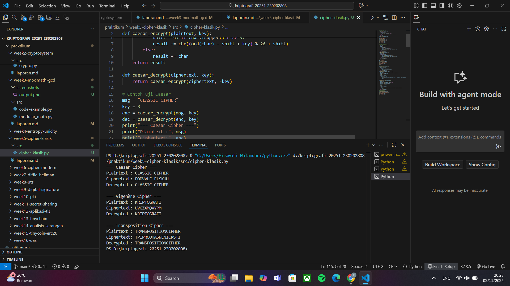

# Laporan Praktikum Kriptografi
Minggu ke-: 5  
Topik: [Cipher-klasik]  
Nama: [Ferdy Ramadhani]  
NIM: [230202808]  
Kelas: [5IKRA]  

---

## 1. Tujuan
1. Memahami konsep dasar kriptografi klasik sebagai dasar dari sistem keamanan modern.
2. Mampu menjelaskan prinsip kerja berbagai algoritma cipher klasik seperti Caesar Cipher, Vigenère Cipher, dan Transposisi Cipher.
3. Dapat melakukan proses enkripsi dan dekripsi menggunakan metode cipher klasik secara manual maupun dengan bantuan program komputer.
4. Mampu menganalisis kelemahan dan kekuatan dari masing-masing algoritma cipher klasik.
5. Dapat mengaitkan penerapan cipher klasik dengan perkembangan kriptografi modern dan keamanan data digital saat ini.

---

## 2. Dasar Teori
Cipher klasik merupakan metode awal dalam kriptografi yang digunakan untuk menyembunyikan pesan dengan cara mengubah bentuk huruf atau posisi karakter agar tidak mudah dibaca oleh pihak lain. Contoh cipher klasik yang paling dikenal adalah Caesar Cipher, Vigenère Cipher, dan Transposisi Cipher. Meskipun sederhana, teknik ini menjadi dasar penting dalam memahami konsep enkripsi dan dekripsi pada sistem keamanan data modern.

Dalam proses enkripsi cipher klasik, konsep aritmetika modular memiliki peran penting, terutama dalam pergeseran huruf atau penggantian karakter. Misalnya, dalam Caesar Cipher setiap huruf digeser berdasarkan nilai tertentu dengan perhitungan mod 26 (jumlah huruf alfabet). Prinsip ini memastikan bahwa hasil enkripsi tetap berada dalam rentang alfabet dan dapat dikembalikan ke bentuk semula melalui proses dekripsi.

Dengan memahami cipher klasik dan aritmetika modular, mahasiswa dapat mengetahui bagaimana prinsip dasar keamanan informasi dibangun, serta bagaimana ide-ide sederhana dari masa lalu berkembang menjadi sistem kriptografi modern yang lebih kompleks seperti RSA atau AES.

---

## 3. Alat dan Bahan
(- Python 3.x  
- Visual Studio Code / editor lain  
- Git dan akun GitHub  
- Library tambahan (misalnya pycryptodome, jika diperlukan)  )

---

## 4. Langkah Percobaan
(Tuliskan langkah yang dilakukan sesuai instruksi.  
Contoh format:
1. Membuat file `caesar_cipher.py` di folder `praktikum/week2-cryptosystem/src/`.
2. Menyalin kode program dari panduan praktikum.
3. Menjalankan program dengan perintah `python caesar_cipher.py`.)

---

## 5. Source Code
(Salin kode program utama yang dibuat atau dimodifikasi.  
Gunakan blok kode:

```python
# ===== Caesar Cipher =====
def caesar_encrypt(plaintext, key):
    result = ""
    for char in plaintext:
        if char.isalpha():
            shift = 65 if char.isupper() else 97
            result += chr((ord(char) - shift + key) % 26 + shift)
        else:
            result += char
    return result

def caesar_decrypt(ciphertext, key):
    return caesar_encrypt(ciphertext, -key)

# Contoh uji Caesar
msg = "CLASSIC CIPHER"
key = 3
enc = caesar_encrypt(msg, key)
dec = caesar_decrypt(enc, key)
print("=== Caesar Cipher ===")
print("Plaintext :", msg)
print("Ciphertext:", enc)
print("Decrypted :", dec)
print()


# ===== Vigenère Cipher =====
def vigenere_encrypt(plaintext, key):
    result = []
    key = key.lower()
    key_index = 0
    for char in plaintext:
        if char.isalpha():
            shift = ord(key[key_index % len(key)]) - 97
            base = 65 if char.isupper() else 97
            result.append(chr((ord(char) - base + shift) % 26 + base))
            key_index += 1
        else:
            result.append(char)
    return "".join(result)

def vigenere_decrypt(ciphertext, key):
    result = []
    key = key.lower()
    key_index = 0
    for char in ciphertext:
        if char.isalpha():
            shift = ord(key[key_index % len(key)]) - 97
            base = 65 if char.isupper() else 97
            result.append(chr((ord(char) - base - shift) % 26 + base))
            key_index += 1
        else:
            result.append(char)
    return "".join(result)

# Contoh uji Vigenère
msg = "KRIPTOGRAFI"
key = "KEY"
enc = vigenere_encrypt(msg, key)
dec = vigenere_decrypt(enc, key)
print("=== Vigenère Cipher ===")
print("Plaintext :", msg)
print("Ciphertext:", enc)
print("Decrypted :", dec)
print()


# ===== Transposition Cipher =====
def transpose_encrypt(plaintext, key=5):
    ciphertext = [''] * key
    for col in range(key):
        pointer = col
        while pointer < len(plaintext):
            ciphertext[col] += plaintext[pointer]
            pointer += key
    return ''.join(ciphertext)

def transpose_decrypt(ciphertext, key=5):
    num_of_cols = int(len(ciphertext) / key + 0.9999)
    num_of_rows = key
    num_of_shaded_boxes = (num_of_cols * num_of_rows) - len(ciphertext)
    plaintext = [''] * num_of_cols

    col = 0
    row = 0
    for symbol in ciphertext:
        plaintext[col] += symbol
        col += 1
        if (col == num_of_cols) or (col == num_of_cols - 1 and row >= num_of_rows - num_of_shaded_boxes):
            col = 0
            row += 1
    return ''.join(plaintext)

# ✅ VERSI PERBAIKAN (lebih akurat):
def transpose_decrypt_fixed(ciphertext, key=5):
    num_cols = len(ciphertext) // key
    num_rows = key
    num_shaded_boxes = (num_cols * num_rows) - len(ciphertext)
    num_cols += 1 if len(ciphertext) % key != 0 else 0

    num_full_cols = len(ciphertext) % key
    plaintext = [''] * num_cols

    col = 0
    row = 0
    for symbol in ciphertext:
        plaintext[col] += symbol
        col += 1
        if (col == num_cols) or (col == num_cols - 1 and row >= key - num_shaded_boxes):
            col = 0
            row += 1
    return ''.join(plaintext)

# Contoh uji Transposisi
msg = "TRANSPOSITIONCIPHER"
enc = transpose_encrypt(msg, key=5)
dec = transpose_decrypt_fixed(enc, key=5)
print("=== Transposition Cipher ===")
print("Plaintext :", msg)
print("Ciphertext:", enc)
print("Decrypted :", dec)

)

---

## 6. Hasil dan Pembahasan
(- Lampirkan screenshot hasil eksekusi program (taruh di folder `screenshots/`).  
- Berikan tabel atau ringkasan hasil uji jika diperlukan.  
- Jelaskan apakah hasil sesuai ekspektasi.  
- Bahas error (jika ada) dan solusinya. 

Hasil eksekusi program Caesar Cipher:




)

---

## 7. Jawaban Pertanyaan
1. Apa kelemahan utama algoritma Caesar Cipher dan Vigenère Cipher?
   Caesar Cipher memiliki kelemahan utama pada ruang kuncinya yang sangat kecil, hanya 25 kemungkinan pergeseran. Hal ini membuat pesan mudah dipecahkan dengan mencoba semua kemungkinan (brute force). Selain itu, pola huruf pada hasil enkripsi masih mirip dengan teks aslinya sehingga dapat diuraikan menggunakan analisis frekuensi huruf.
Sementara itu, Vigenère Cipher memang lebih kuat karena menggunakan kunci berupa kata, namun tetap lemah jika kunci yang digunakan pendek atau berulang. Pola perulangan kunci ini dapat dianalisis menggunakan metode Kasiski atau uji Friedman untuk menebak panjang kunci. Akibatnya, kedua algoritma ini dianggap tidak aman dan hanya digunakan sebagai dasar pembelajaran dalam kriptografi modern.
2. Mengapa cipher klasik mudah diserang dengan analisis frekuensi?
   Cipher klasik mudah diserang dengan analisis frekuensi karena proses enkripsinya hanya mengubah bentuk huruf tanpa mengubah pola kemunculannya. Dalam bahasa tertentu, beberapa huruf muncul lebih sering daripada yang lain (misalnya huruf “E” dalam bahasa Inggris). Pola frekuensi ini tetap terlihat meskipun teks telah dienkripsi.
Penyerang dapat membandingkan pola frekuensi huruf pada ciphertext dengan pola umum bahasa yang digunakan. Dengan mencocokkan huruf yang paling sering muncul, mereka dapat menebak huruf asli dan secara bertahap memecahkan seluruh pesan.
Karena sifatnya yang masih mempertahankan struktur bahasa, cipher klasik seperti Caesar dan Vigenère menjadi rentan terhadap serangan ini dan tidak cocok untuk sistem keamanan modern yang memerlukan acak dan kompleksitas tinggi. 
3. Bandingkan kelebihan dan kelemahan cipher substitusi vs transposisi.
   Cipher substitusi bekerja dengan mengganti setiap huruf pada teks asli dengan huruf lain sesuai pola tertentu. Kelebihannya, metode ini sederhana dan cepat digunakan, serta mampu mengubah bentuk pesan secara langsung. Namun, kelemahannya adalah pola frekuensi huruf masih terlihat, sehingga mudah dipecahkan menggunakan analisis frekuensi jika kunci diketahui sebagian.
Sementara itu, cipher transposisi tidak mengganti huruf, melainkan mengubah urutan posisi huruf dalam pesan. Kelebihannya, struktur huruf tetap sama sehingga lebih sulit dikenali dengan analisis frekuensi biasa. Namun, kelemahannya adalah jika pola perubahan urutan dapat ditebak (misalnya panjang blok atau kunci), pesan bisa dengan mudah diuraikan kembali.
Secara umum, cipher substitusi mengandalkan perubahan karakter, sedangkan cipher transposisi bergantung pada perubahan posisi. Kombinasi keduanya dapat menghasilkan enkripsi yang lebih kuat dibandingkan jika digunakan secara terpisah.
)
---

## 8. Kesimpulan
(Tuliskan kesimpulan singkat (2–3 kalimat) berdasarkan percobaan.  )

---

## 9. Daftar Pustaka
(Cantumkan referensi yang digunakan.  
Contoh:  
- Katz, J., & Lindell, Y. *Introduction to Modern Cryptography*.  
- Stallings, W. *Cryptography and Network Security*.  )

---

## 10. Commit Log
(Tuliskan bukti commit Git yang relevan.  
Contoh:
```
commit abc12345
Author: Nama Mahasiswa <email>
Date:   2025-09-20

    week2-cryptosystem: implementasi Caesar Cipher dan laporan )
```
