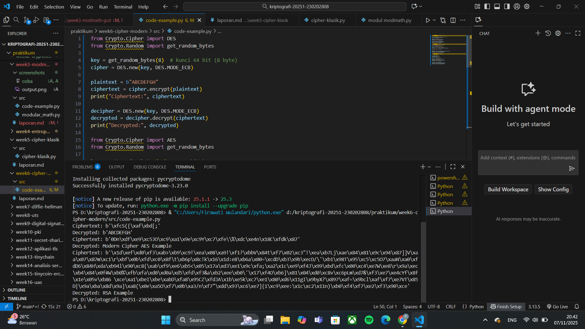

# Laporan Praktikum Kriptografi
Minggu ke-: 6  
Topik: [Cipher Modern]  
Nama: [Ferdy Ramadhani]  
NIM: [230202808]  
Kelas: [5IKRA]  

---

## 1. Tujuan
1. Mengimplementasikan algoritma DES untuk blok data sederhana.
2. Menerapkan algoritma AES dengan panjang kunci 128 bit.
3. Menjelaskan proses pembangkitan kunci publik dan privat pada algoritma RSA.

---

## 2. Dasar Teori
Cipher modern merupakan sistem kriptografi yang digunakan untuk mengamankan data digital melalui proses enkripsi dan dekripsi menggunakan algoritma matematis yang kompleks. Tidak seperti cipher klasik yang hanya mengandalkan substitusi atau transposisi sederhana, cipher modern bekerja berdasarkan prinsip kerahasiaan kunci (key secrecy) dan kerumitan komputasional (computational complexity). Tujuannya bukan hanya untuk menyembunyikan pesan, tetapi juga untuk menjamin kerahasiaan, keutuhan, dan keaslian data dalam komunikasi digital.

Terdapat dua kategori utama dalam cipher modern, yaitu kriptografi simetris dan kriptografi asimetris. Kriptografi simetris (seperti AES dan DES) menggunakan satu kunci yang sama untuk enkripsi dan dekripsi, sedangkan kriptografi asimetris (seperti RSA dan ECC) menggunakan pasangan kunci publik dan privat. Prinsip matematika yang mendasarinya melibatkan operasi modular, teori bilangan prima, serta fungsi satu arah yang sulit dibalik secara komputasional.

Selain itu, cipher modern juga mendukung berbagai mekanisme keamanan tambahan seperti hash function, digital signature, dan key exchange protocols untuk memastikan integritas dan autentikasi pesan. Dengan kombinasi tersebut, cipher modern menjadi pondasi utama dalam sistem keamanan informasi saat ini, digunakan dalam komunikasi internet (HTTPS), transaksi perbankan, hingga teknologi blockchain.

---

## 3. Alat dan Bahan
(- Python 3.x  
- Visual Studio Code / editor lain  
- Git dan akun GitHub  
- Library tambahan (misalnya pycryptodome, jika diperlukan)  )

---

## 4. Langkah Percobaan
(Tuliskan langkah yang dilakukan sesuai instruksi.  
Contoh format:
1. Membuat file `caesar_cipher.py` di folder `praktikum/week2-cryptosystem/src/`.
2. Menyalin kode program dari panduan praktikum.
3. Menjalankan program dengan perintah `python caesar_cipher.py`.)

---

## 5. Source Code
```python

from Crypto.Cipher import DES
from Crypto.Random import get_random_bytes

key = get_random_bytes(8)  # kunci 64 bit (8 byte)
cipher = DES.new(key, DES.MODE_ECB)

plaintext = b"ABCDEFGH"
ciphertext = cipher.encrypt(plaintext)
print("Ciphertext:", ciphertext)

decipher = DES.new(key, DES.MODE_ECB)
decrypted = decipher.decrypt(ciphertext)
print("Decrypted:", decrypted)

from Crypto.Cipher import AES
from Crypto.Random import get_random_bytes

key = get_random_bytes(16)  # 128 bit key
cipher = AES.new(key, AES.MODE_EAX)

plaintext = b"Modern Cipher AES Example"
ciphertext, tag = cipher.encrypt_and_digest(plaintext)

print("Ciphertext:", ciphertext)

# Dekripsi
cipher_dec = AES.new(key, AES.MODE_EAX, nonce=cipher.nonce)
decrypted = cipher_dec.decrypt(ciphertext)
print("Decrypted:", decrypted.decode())

from Crypto.PublicKey import RSA
from Crypto.Cipher import PKCS1_OAEP

# Generate key pair
key = RSA.generate(2048)
private_key = key
public_key = key.publickey()

# Enkripsi dengan public key
cipher_rsa = PKCS1_OAEP.new(public_key)
plaintext = b"RSA Example"
ciphertext = cipher_rsa.encrypt(plaintext)
print("Ciphertext:", ciphertext)

# Dekripsi dengan private key
decipher_rsa = PKCS1_OAEP.new(private_key)
decrypted = decipher_rsa.decrypt(ciphertext)
print("Decrypted:", decrypted.decode())

```


---

## 6. Hasil dan Pembahasan
(- Lampirkan screenshot hasil eksekusi program (taruh di folder `screenshots/`).  
- Berikan tabel atau ringkasan hasil uji jika diperlukan.  
- Jelaskan apakah hasil sesuai ekspektasi.  
- Bahas error (jika ada) dan solusinya. 

Hasil eksekusi program Caesar Cipher:




)

---

## 7. Jawaban Pertanyaan
1. Apa perbedaan mendasar antara DES, AES, dan RSA dalam hal kunci dan keamanan?
   - Perbedaan utama antara DES, AES, dan RSA terletak pada jenis algoritma dan sistem kuncinya. DES dan AES merupakan algoritma kriptografi simetris, di mana proses enkripsi dan dekripsi menggunakan kunci yang sama, sedangkan RSA termasuk kriptografi asimetris yang memakai dua kunci berbeda, yaitu kunci publik dan kunci privat. DES menggunakan kunci 56 bit yang kini dianggap tidak aman, sementara AES memiliki panjang kunci 128, 192, dan 256 bit yang jauh lebih kuat dan efisien. RSA menggunakan kunci berukuran besar, biasanya 2048 bit atau lebih, untuk menjamin keamanan berbasis faktorisasi bilangan prima.
Dari segi keamanan dan kinerja, AES menjadi standar global karena cepat dan sangat aman untuk melindungi data dalam jumlah besar. RSA, meski lebih lambat, unggul dalam autentikasi dan pertukaran kunci karena tingkat keamanannya yang tinggi terhadap serangan matematis. Sementara itu, DES telah ditinggalkan karena tidak lagi mampu menahan serangan brute force. Dengan demikian, AES digunakan untuk enkripsi data modern, sedangkan RSA digunakan untuk menjaga integritas dan keamanan komunikasi digital.
2. Mengapa AES lebih banyak digunakan dibanding DES di era modern?
   - AES lebih banyak digunakan dibanding DES di era modern karena memiliki tingkat keamanan yang jauh lebih tinggi, efisiensi yang lebih baik, serta ketahanan terhadap serangan kriptografi yang tidak dimiliki oleh DES.
DES hanya menggunakan kunci sepanjang 56 bit, yang kini dianggap terlalu pendek dan mudah dipecahkan dengan teknik brute force menggunakan komputer modern. Sebaliknya, AES (Advanced Encryption Standard) menggunakan panjang kunci 128, 192, atau 256 bit, sehingga jumlah kemungkinan kuncinya sangat besar dan hampir mustahil dipecahkan dengan kekuatan komputasi saat ini. Selain itu, AES dirancang dengan struktur matematika yang lebih kompleks dan efisien, membuat proses enkripsi dan dekripsi berjalan cepat bahkan pada perangkat dengan sumber daya terbatas.
Selain faktor keamanan dan efisiensi, AES juga diadopsi secara resmi oleh NIST (National Institute of Standards and Technology) sebagai standar enkripsi global untuk melindungi data pemerintah, bisnis, dan komunikasi digital. Hal ini menjadikan AES lebih dipercaya dan luas digunakan dalam berbagai aplikasi modern seperti VPN, Wi-Fi (WPA2/WPA3), HTTPS, serta enkripsi file dan perangkat penyimpanan. Dengan kata lain, AES menggantikan DES karena lebih aman, cepat, dan relevan untuk kebutuhan keamanan data masa kini.
3. Mengapa RSA dikategorikan sebagai algoritma asimetris, dan bagaimana proses pembangkitan kuncinya?
   - RSA dikategorikan sebagai algoritma asimetris karena menggunakan dua kunci berbeda dalam proses enkripsi dan dekripsi, yaitu kunci publik (public key) dan kunci privat (private key). Kedua kunci ini saling terkait secara matematis, tetapi tidak dapat diturunkan secara langsung satu sama lain. Kunci publik digunakan untuk mengenkripsi pesan, sedangkan kunci privat digunakan untuk mendekripsi pesan. Dengan cara ini, RSA memungkinkan keamanan komunikasi tanpa perlu berbagi kunci rahasia secara langsung seperti pada algoritma simetris, sehingga sangat cocok untuk autentikasi dan pertukaran kunci di jaringan terbuka.

Proses pembangkitan kunci pada RSA melibatkan beberapa langkah matematis yang berbasis pada teori bilangan prima. Pertama, dua bilangan prima besar p dan q dipilih secara acak, kemudian dihitung nilai n = p × q yang akan menjadi bagian dari kunci publik. Selanjutnya, dihitung nilai φ(n) = (p−1)(q−1), yaitu fungsi totien Euler dari n. Setelah itu, dipilih bilangan e sebagai eksponen publik yang relatif prima terhadap φ(n), biasanya nilai kecil seperti 65537 digunakan karena efisien. Lalu dihitung d, yaitu invers modular dari e terhadap φ(n), yang memenuhi persamaan: $e \cdot d \equiv 1 \pmod{\varphi(n)}$


---

## 8. Kesimpulan
- Dari praktikum ini dapat disimpulkan bahwa cipher modern seperti DES, AES, dan RSA memiliki peran penting dalam menjaga keamanan data digital dengan mekanisme enkripsi dan dekripsi yang berbeda. AES terbukti lebih unggul dibanding DES karena memiliki kunci yang lebih panjang, keamanan yang lebih kuat, dan efisiensi yang tinggi dalam proses enkripsi data. Sementara itu, RSA berfungsi sebagai algoritma asimetris yang andal untuk autentikasi dan pertukaran kunci karena menggunakan dua kunci berbeda, yaitu kunci publik dan kunci privat.

Secara keseluruhan, penerapan ketiga algoritma tersebut menunjukkan bagaimana kriptografi modern bekerja untuk melindungi kerahasiaan, keaslian, dan integritas data dalam berbagai sistem komunikasi digital masa kini.

---

## 9. Daftar Pustaka
(Cantumkan referensi yang digunakan.  
Contoh:  
- Katz, J., & Lindell, Y. *Introduction to Modern Cryptography*.  
- Stallings, W. *Cryptography and Network Security*.  )

---

## 10. Commit Log
(Tuliskan bukti commit Git yang relevan.  
Contoh:
```
commit abc12345
Author: Nama Mahasiswa <email>
Date:   2025-09-20

    week2-cryptosystem: implementasi Caesar Cipher dan laporan )
```
